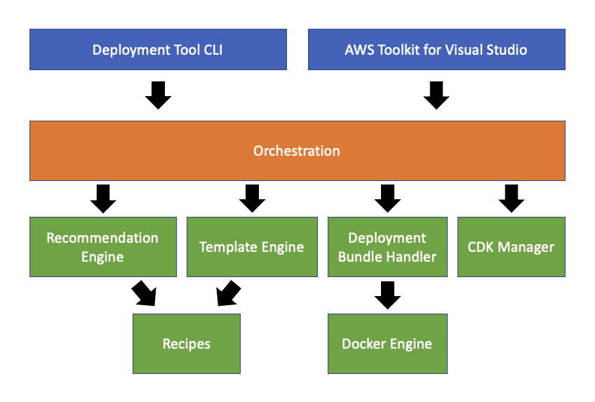

# AWS .NET Deployment Tool Design Doc

The purpose of this document is to describe the high level components of the new .NET Deployment Tool that is currently being developed by the AWS .Net Developer Experience team. The .NET Deployment Tool aims to improve the development and deployment of .NET cloud-native applications on AWS. .NET developers can deploy their applications in just a few steps from the .NET CLI and accelerate application development by using use-case specific libraries and application templates.
\
&nbsp;

## Problem Statement

When .NET developers begin their cloud journey, many of them try to deploy an existing application on AWS, and are often overwhelmed by the abundance of AWS service offerings. They struggle to select the right compute service, provision the underlying infrastructure, and understand how to build, package, and deploy their application artifacts. Often times, they give up during the early stages of the process. 

As developers progress to the adoption phase, many of them prefer creating .NET microservices using containers or Lambda to minimize the infrastructure management. They have to use low level service APIs, which often leads to more boilerplate code than business logic code. Additionally, this process needs to be repeated by every developer building a similar application, increasing the odds of inconsistencies across applications. Furthermore, there is no way to collaborate across teams or the organization to develop and deploy to AWS.
\
&nbsp;

## Goals

* A .NET developer can get their .NET cloud-ready application quickly deployed to AWS with minimal knowledge of AWS.
* The tool will not just be useful for proof of concept and demo applications, but will be useful for getting started on AWS while learning how AWS works.
* The tool will not overwhelm new developers with all the available options on AWS, but will give them an opinionated experience to the right AWS service and deployment technology for their application.
* Teache .NET developers how to use AWS Services and AWS Tools like the CDK.
* Idiomatic and simple install process for the tooling
* Only requires prerequisites for tools that are common for .NET developers to have like the .NET CLI, Docker CLI and Node.
* Reuses other AWS tooling, like the CDK, as much as possible as long as the experience of using the tooling is seamless and .NET developers don’t have to be an expert on that tooling to get started.    
* The tool will be extensible for developers/architects to promote their own best practices within their ecosystem.
\
&nbsp;

## Use Cases

The list of supported use cases is constantly growing. The tool is designed in an extensible way to easily allow adding more and more use cases. As of today, the supported use cases are as follows:

* **Deploying an ASP.NET Core App to Amazon ECS using Fargate**\
ASP.NET Core applications built as a container and deployed to Amazon Elastic Container Service (Amazon ECS) with compute power managed by AWS Fargate compute engine. Recommended for applications that can be deployed as a container image. If your project does not contain a Dockerfile, one will be generated for the project.
* **Deploying an ASP.NET Core App to AWS Elastic Beanstalk on Linux**\
Deploy an ASP.NET Core application to AWS Elastic Beanstalk. Recommended for applications that are not set up to be deployed as containers.
* **Deploying a Blazor WebAssembly App to Amazon S3**\
Deploy a Blazor WebAssembly application to an Amazon S3 bucket. The Amazon S3 bucket created during deployment will be configured for web hosting and its contents will be open to the public with read access.
* **Deploying a Scheduled Task on Amazon ECS using Fargate**\
Deploy a console application as a scheduled task to Amazon Elastic Container Service (Amazon ECS). Recommended for applications that can be deployed as a container image. If your project does not contain a Dockerfile, one will be generated for the project.
* **Deploying a Service on Amazon ECS using Fargate**\
Deploy a console application as a service to Amazon Elastic Container Service (Amazon ECS). Recommended for applications that can be deployed as a container image. If your project does not contain a Dockerfile, one will be generated for the project.
\
&nbsp;

## Components

The deployment tool will be made up of several components. The frontends for the tooling will only interact with the _orchestration_ component. This will ensure the experience for both the CLI and Visual Studio will have the same capabilities but the presentation will be tailored for the particular frontend component.
\
&nbsp;

<p align="center">
  
</p>

&nbsp;

### Deployment Tool CLI

The Deployment Tool CLI is a `dotnet tool` that can be installed from NuGet.org (http://nuget.org/) by running the following command:
```
dotnet tool install --global AWS.Deploy.CLI
```

The Deployment Tool CLI can be initiated by running the following:
```
dotnet aws
````

The CLI has an interactive experience driven by the metadata from the `Orchestration` component for performing initial deployments. Redeployment experience can be either interactive or to change settings from the previous deployment or non-interactive for fast turnaround deployments while doing iterative development.

To have an experience familiar to other .NET tools and speed up development, the NuGet package `System.CommandLine` (https://www.nuget.org/packages/System.CommandLine/2.0.0-beta1.20371.2) is used to handle argument parsing, command line help and command dispatching. This is a relatively new package from Microsoft which takes the experience used in some of their tooling and turns it into a open source package. **Note:** this package is currently in beta but we hope the project will go out of beta before this tooling is in preview. If this package remains in beta too long we will need to plan additional effort to replace this packages functionality. 

**AWS Profile** and **Region** are configured by either specifying them on the command line or using the AWS SDK for .NET search path. If the .NET CLI tool is run in an EC2 instance or CodeBuild, credentials and region can be picked up automatically from the environment. If no credentials are found but AWS credential profiles are registered, the tool will display a list of the profiles and have the user pick a profile. If region setting is not found or determined from the environment, the tool will display the list of regions for the user to pick. To ensure the user knows what account and region is used the tooling will display the determined profile and region.

&nbsp;

### AWS Toolkit for Visual Studio

The toolkit’s interface will be a new menu option from the context menu of a .NET project in the Solution Explorer called `Publish to AWS ...`. The menu item will be displayed for .NET Core and higher projects. This menu item will eventually replace the existing publish to AWS options in the context menu, see the opt in section below to see how the new deployment tooling will be phased into the toolkit. 

To ensure the menu item doesn’t show up for .NET Core projects targeting Desktop or mobile applications, the toolkit will need to check the Sdk Attribute of the project file as described in the recommendation engine section. 
 
The toolkit will pass in the selected AWS Credentials and Region the toolkit is currently configured for.

The wizard is driven by the metadata of the orchestrator. The wizard will contain 2 pages. The first page shows the recommendations determined by the orchestrator. The second page will be an editable grid of options for the recommendation. Non-advanced parameters will be displayed at the top of the grid.

Although the toolkit will use the orchestrator, it will interface with the orchestrator through a special server mode the CLI will run in. The server mode allows the toolkit to communicate with the CLI using Rest APIs. With the server mode built into the CLI, the same technique can be reused with JetBrains Rider and Visual Studio Code.

The toolkit will manage installing compatible versions of the CLI in the background. The version of the CLI used by the toolkit will be separate then the global version installed by the user. That way if a user installs a newer version of the .NET CLI from NuGet that will not affect the functionality of the toolkit. Maintaining a separate version for the toolkit is accomplished using .NET’s tools manifest (https://docs.microsoft.com/en-us/dotnet/core/tools/local-tools-how-to-use) feature which was designed for .NET projects to control the versions used for projects.

Below is an example of invoking the .NET CLI in server mode:
```
dotnet aws server-mode --port <port> --parent-pid <id-of-process-launching-server-mode>
```

&nbsp;

### Orchestration

The `Orchestration` component sits between the front-ends, currently the CLI and Visual Studio Toolkit, and the rest of the system components. This way, we can ensure that all the front-ends have similar functionalities as well as future maintenance and feature updates are consitent throughout the Deployment Tool experience. In addition to that, adding new front-ends, such as the Toolkit for Rider and other IDEs, is simpler now that the front end can interface with the `Orchestration` component, instead of implementing the same functionality in the front end.

&nbsp;

### Recipes

The Recipes component contains the content delivered with the `Deployment Tool`. This is a collection of `Recipe Definitions`, where a Recipe is a description of a type of deployment. Included in this description is the available options that can be set by a user to a configure that type of deployment. For every `Recipe Definition`, there is a .NET CDK project template that defines the deployment as `Infrastructure as Code`. The templates are configurable using the `Recipe Definition` `Option Settings`.

The `Orchestration` component gives the front-end components access to configure the `Option Settings` defined in the `Recipe Definitions` specific to the type of deployment that is compatible with the Project the user is trying to deploy. Once the front-end takes care of configuring and setting values for the `Option Settings`, the `Orchestration` component generates a .NET CDK project from the .NET CDK templates that are provided with the `Recipes` component and serializes the configured settings into a local settings file placed alongside the generated .NET CDK project.

In addition to that, the `Recipes` component houses a collection of `Deployment Bundle Definitions` which are the descriptions of the type of deployment package to be created. As of now, the `Deployment Tool` can create 2 types of packages, a `dotnet publish` zip file and a `Docker` image.

&nbsp;

### Recommendation Engine

The `Recommendation Engine` takes in a project and a list of `Recipe Definitions` that are available. The engine then returns a list of `Recommendations` based on the compatible recipes and sorts them by descending order of compatibility, meaning the first recommendation is also the most recommended one.

A `Recipe Definition` defines a collection of rules and tests that are specific to that recipe which will be used to determine the compatibility of a Recipe with a given project. The engine goes through each rule defined in the recipe and checks to see what test is being used and performs the test. If the test fails then the rule fails. All the rules in a Recipe need to pass in order for that Recipe to be recommended by the engine.

A lot of the tests are based on inspecting the project file for the .NET project. Here is an example of a project file for an ASP.NET Core web project.
```
<Project Sdk="Microsoft.NET.Sdk.Web">

  <PropertyGroup>
    <TargetFramework>netcoreapp3.1</TargetFramework>
  </PropertyGroup>
  
  <ItemGroup>
    <PackageReference Include="AWSSDK.Core" Version="3.5.0" />
  </ItemGroup>

</Project>
```

The supported tests are:

* MSProjectSdkAttribute - At the root element of a project file is the Sdk attribute. This indicates if the project is an ASP.NET Core project based on the value of `Micrsoft.NET.Sdk.Web` or a generic console application which as a value of `Microsoft.NET.Sdk`. .NET projects for applications like _Windows Desktop Applications_ will be filtered out because they contain different values for the Sdk attribute like `Microsoft.NET.Sdk.WindowsDesktop`.
* MSProperty - Checks to see if a Property under a PropertyGroup element in the project has one of the allowed values. For example Beanstalk currently support .NET Core 2.1 and 3.1. A rule in the recipe would make sure the `TargetFramework` is set to either netcoreapp2.1 or netcoreapp3.1.
* MSPropertyExists - Checks to see if a specific property in a PropertyGroup exists. A common use case is to exclude Lambda projects from being deployed to Beanstalk by checking to see if the `AWSProjectType` is defined in the project.
* NuGetPackageReference - Checks to see if a specific NuGet package is referenced by the project. A common use case is to exclude Blazor WebAssembly projects from being deployed to Beanstalk by looking for the NuGet reference `Microsoft.AspNetCore.Components.WebAssembly`.
* FileExists - Checks to see if a project has the file indicated in the rule in the project directory. A common use case is to see if the project contains a _Dockerfile_.

&nbsp;

### Template Engine

The .NET Core Template Engine from Microsoft (https://github.com/dotnet/templating) is being used to generate CDK Templates in the Deployment Tool. The CDK Templates, provided as part of the Recipes component, are valid project templates that work with the Microsoft Template Engine. These templates are installed to the system as part of the tool and used to generate any future CDK project. _Note:_ We are not installing the CDK Templates to the System's `dotnet new` CLI. A private one is used that is specific to the Deployment Tool.

&nbsp;

### Deployment Bundle Handler

The Deployment Tool supports creating two types of deployment bundles, a `dotnet publish` zip file and a `Docker` image. The supported types of deployments are included as part of the Recipes component. They are called `Deployment Bundle Definitions`. Each `Recipe` defines the type of Deployment Bundle to be used for deployment. The `Deployment Bundle Handler` then takes care of creating that bundle after `Option Settings` customization is done, and prior to generating a CDK template. The deployment bundle is created early on to be able to detect a failure in the process and allow the user to correct it by updating some of the `Option Settings` that may have caused the issue. Once that process is completed, the details of the created deployment bundle are passed down to the generated CDK template to be used in deployment.

&nbsp;

### CDK Manager

The Deployment Tool uses `AWS CDK for .NET` (https://github.com/aws/aws-cdk) to deploy user application to AWS. This means, AWS CDK needs to be installed on the user's machine in order for the Deployment Tool to use it. The Deployment Tool detects whether the AWS CDK CLI is installed or not in the system's global `node_modules`. If a global installation does not exist, the Deployment Tool proceeds with installing the required AWS CDK CLI in the local node_modules, which is a temporary directory for the tool under the User Directory folder. If a global installation of the AWS CDK CLI exists but is not compatible with the Deployment Tool, then the Deployment Tool proceeds with installing the required AWS CDK CLI in the local node_modules. In case there exists a local installation of the AWS CDK CLI but is not compatible with the Deployment Tool, then the local installation is upgraded to  the supported version in the local node_modules.

&nbsp;

### Docker Engine

The `Docker Engine` component is responsible for generating a `Dockerfile` that is compatible with the user project to be deployed. The Deployment Tool supports deploying projects that do not include a _Dockerfile_ to a containerized service. It does that by generating a compatible _Dockerfile_ for the project. The engine detects project attributes such as the `SDK Type` and `TargetFramework` and determines the appropriate docker base images to use. In addition to that, the engine detects if the current project is part of a Solution and if that solution has other project to be included in the _Dockerfile_.