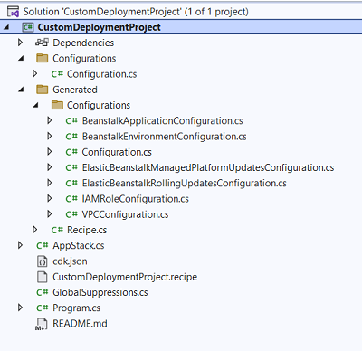

# CDK Project

Each deployment project has a C# Cloud Development Kit (CDK) project. This CDK project is used to create the AWS infrastructure as a CloudFormation stack based on the user settings and to deploy your project to that infrastructure.

Read our [tutorial](../../tutorials/custom-project.md) to see how you can customize this CDK project to add additional infrastructure resources for your deployments.

### What is AWS CDK?

The [AWS Cloud Development Kit (AWS CDK)](https://aws.amazon.com/cdk/) is an open-source software development framework to define your cloud application resources using familiar programming languages.

The following links are useful resources to learn more about AWS CDK and how to write .NET CDK projects.

* [AWS CDK Developer Guide](https://docs.aws.amazon.com/cdk/v2/guide/home.html)
* [.NET CDK Workshop](https://cdkworkshop.com/40-dotnet.html)
* [.NET CDK Reference](https://docs.aws.amazon.com/cdk/api/v2/dotnet/api/index.html)

### Layout of a CDK deployment project

The layout of the generated CDK project puts all the code that was used to create the AWS resources defined in the starting recipe in a directory called **Generated**.



It is recommended to not modify the code in the `Generated` directory to make it easier to merge future changes from the starting recipe into your custom deployment project. If you do not intend to update your custom deployment project from the original built-in recipe you may modify the code or rearrange the directory layout.

If you choose to not modify the `Generated` code it is recommended to customize the CDK project starting from the `AppStack` class. Here is the constructor of `AppStack`.

```csharp
internal AppStack(Construct scope, IDeployToolStackProps<Configuration> props)
    : base(scope, props.StackName, props)
{
    _configuration = props.RecipeProps.Settings;

    // Setup callback for generated construct to provide access to customize CDK properties before creating constructs.
    CDKRecipeCustomizer<Recipe>.CustomizeCDKProps += CustomizeCDKProps;

    // Create custom CDK constructs here that might need to be referenced in the CustomizeCDKProps. For example if
    // creating a DynamoDB table construct and then later using the CDK construct reference in CustomizeCDKProps to
    // pass the table name as an environment variable to the container image.

    // Create the recipe defined CDK construct with all of its sub constructs.
    var generatedRecipe = new Recipe(this, props.RecipeProps);

    // Create additional CDK constructs here. The recipe's constructs can be accessed as properties on
    // the generatedRecipe variable.
}
```

The `var generatedRecipe = new Recipe(this, props.RecipeProps);` statement creates all of the AWS resources specified in the CDK code in the `Generated` directory. Your customizations can create additional custom AWS resources from CDK constructs either before or after this statement.

If you have custom resources you want to connect to resources generated by the recipe, create your custom resource before the statement. For example, you might want to set an environment variable in a container definition to the name of a custom DynamoDB table. In that scenario, your custom table should be created before the statement. However, if you want to connect a custom resource to a resource created by the recipe, create the custom resource after the statement. An example might be connecting a custom Amazon CloudFront distribution to an Application Load Balancer created in a recipe. Custom resources that have no connection to the resources created by the recipe can be added before, or after, the statement.

In this constructor a callback method called `CustomizeCDKProps` is setup. This callback method is called right before any constructs are created from the `Recipe`. This allows modifying the construct's property object before it is passed into the construct.

The example below shows the `CustomizeCDKProps` callback that checks to see if the resource being created is the Beanstalk Environment. If it is, cast the property object to the appropriate property object and then make whatever customizations are needed.

```csharp
private void CustomizeCDKProps(CustomizePropsEventArgs<Recipe> evnt)
{
    if (string.Equals(evnt.ResourceLogicalName, nameof(evnt.Construct.BeanstalkEnvironment)))
    {
        if (evnt.Props is CfnEnvironmentProps props)
        {
            Console.WriteLine("Customizing Beanstalk Environment");
        }
    }
}
```

### Main method in Program.cs

The `Main` method in `Program.cs` for the CDK deployment project must be coded in a certain style to ensure compatibility with the deploy tool. The AWS Deploy Tool relies on .NET's Configuration system to pass along settings from the deploy tool to the CDK project. In the example below the `ConfigurationBuilder().AddAWSDeployToolConfiguration(app)` method reads the settings that were passed into the project from the deploy tool.

With the configuration read from the deploy tool, the CDK environment is set to the account and region the deploy tool was configured with.

The other major difference from normal CDK projects is the call to `CDKRecipeSetup.RegisterStack`. This is required to stamp the CloudFormation stack with the recipe id that created the stack. Future redeployments can only update existing stacks that were created by the original recipe. It also serializes the settings collected from the deploy tool into the metadata for the CloudFormation stack so redeployments can use the previous settings used for deployment.

```csharp
public static void Main(string[] args)
{
    var app = new App();

    var builder = new ConfigurationBuilder().AddAWSDeployToolConfiguration(app);
    var recipeProps = builder.Build().Get<RecipeProps<Configuration>>();
    var appStackProps = new DeployToolStackProps<Configuration>(recipeProps)
    {
        Env = new Environment
        {
            Account = recipeProps.AWSAccountId,
            Region = recipeProps.AWSRegion
        }
    };

    // The RegisterStack method is used to set identifying information on the stack
    // for the recipe used to deploy the application and preserve the settings used in the recipe
    // to allow redeployment. The information is stored as CloudFormation tags and metadata inside
    // the generated CloudFormation template.
    CDKRecipeSetup.RegisterStack<Configuration>(new AppStack(app, appStackProps), appStackProps.RecipeProps);

    app.Synth();
}
```

### Configuration options

The option settings that are defined in the [recipe file](recipe-file.md) are passed into the CDK project and then deserialized into the `Configuration` object.

When you add new settings to the recipe file, you also need to add the `Id` of the new settings to the `Configuration` object. If you added an `Object` setting with a collection of child settings, first create a new type representing that entire `Object`. For reach child setting id, add a property on the new type. Finally, add a new property on `Configuration` for your new type with the property name being the id of the `Object` setting.

The `Configuration` object follows the same `Generated` directory pattern described above. Custom settings should be added to the partial `Configuration.cs` file outside of the `Generated` directory.
