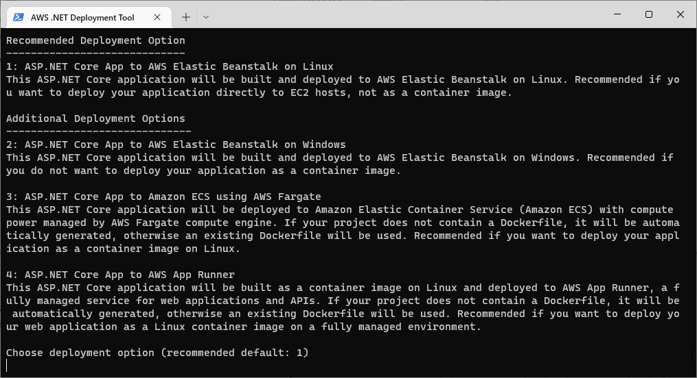
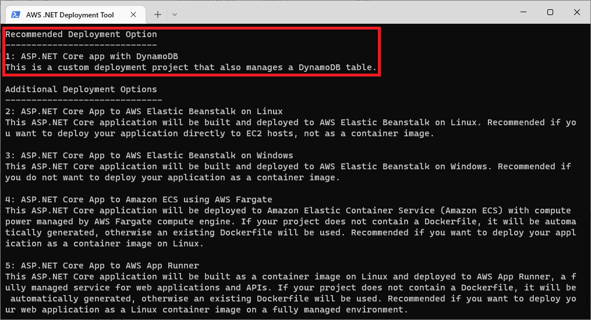

# Deployment Projects

### What is a deployment recipe?

The tool provides intelligent deployment recommendations that are tailored to your specific .NET application. The recommendation rules are defined in the `deployment recipes`. These recipes let you configure a pre-defined set of AWS resources related to your application such as IAM roles, virtual private clouds, load balancers, and other.

There is a built-in recipe for [each supported project type](../support.md). All recipe definitions are available [on GitHub](https://github.com/aws/aws-dotnet-deploy/tree/main/src/AWS.Deploy.Recipes/RecipeDefinitions).

### What is a deployment project?

What if your application uses additional AWS resources that are not included in the built-in recipe, such as DynamoDB tables or SQS queues? In this case, you can extend one of the existing recipes and create a custom `deployment project` to manage additional AWS resources and services.

Once you create and customize your deployment project, it will be displayed alongside the built-in recipes as a custom deployment option.

** Before:** _The recommended deployment target is a built-in recipe for ASP.NET Core applications._

** After:** _The recommended deployment target is a custom deployment project that manages a DynamoDB table in addition to the ASP.NET Core project._

### Parts of a deployment project

A deployment project consists of two parts. For details, refer to the full reference guides below.

* [Recipe file](./recipe-file.md) - a  JSON configuration file that drives the deployment experience.
* [.NET CDK project](./cdk-project.md) - a C# project that uses the [AWS Cloud Development Kit (CDK)](https://aws.amazon.com/cdk/) to define the infrastructure that will be created.

### Creating a deployment project

To create a custom deployment project, run this command in the directory of the .NET project you wish to deploy. See [`deployment-project` command](../commands/project.md) for more details.

    dotnet aws deployment-project generate --output <output-directory> --project-display-name <display-name>

The list of built-in recipes that are compatible with your .NET project will be displayed. Select the recipe that you will use to customize, and a deployment project will be created in the `--output` directory.

   > Note: It is important to add your deployment projects to source control. If your deployment project has been deleted, you will not be able to re-deploy your application to the same CloudFormation stack.

Now you can begin customizing the deployment project. See our [step-by-step tutorial](../../tutorials/custom-project.md) for a step-by-step instructions.

### Searching for deployment projects

When you run the `dotnet aws deploy` command, the tool searches for deployment projects anywhere underneath the solution (.sln) directory of project you are deploying. It also ensures that each deployment project iscompatible with the .NET project being deployed.

To point to a deployment project that is outside the solution directory, use the `--deployment-project` switch to pass in the path of the deployment project to use. This is common when sharing deployment projects across multiple solutions.

