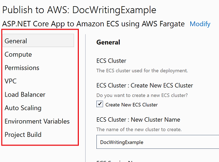

# Recipe file schema

Each deployment project has a JSON file with a `.recipe` extension. This recipe file defines the type of .NET projects the recipe is compatible with and the settings that will be shown to users.

Read our [tutorial](../../tutorials/custom-project.md) to see how you can modify this file to drive the custom deployment experience and display custom option settings to the users. The full schema for the recipe file can be found [here](https://github.com/aws/aws-dotnet-deploy/blob/main/src/AWS.Deploy.Recipes/RecipeDefinitions/aws-deploy-recipe-schema.json).

### Top level settings

This is the list of top level properties in the recipe definition.

* **Id** - the Id of the deployment project. The CloudFormation stack will be tagged with this Id which is used to identify which stacks to update when redeploying.
* **Name** - the name of the deployment project, shown in the list of recommendations.
* **ShortDescription** - description used when showing the list of recommendations.
* **Description** - longer description shown when hovering over the recommendation in Visual Studio.
* **TargetService** - the main AWS service the application will be deployed to. Visual Studio uses this to provide visual indicators.
* **DeploymentType** - for deployment projects this value should always be `CdkProject`.
* **DeploymentBundle** - how the .NET project being deploying should be bundled. Allowed values are `Container` and `DotnetPublishZipFile`.
* **DisplayedResources** - the list of resources to display to users at the end of the deployment.
* **RecipePriority** - the priority of the recipe in the compatibility list.
* **RecommendationRules** - the list of rules to determine the recipe's compatibility with the project being deployed.
* **Categories** - the list of categories for the option settings.
* **OptionSettings** - the list of settings users can configure during deployment.


### Displayed Resources

The `DisplayedResources` array contains a list of resources that the deployment tooling should display after deployment is complete. This is typically the primary resources for a deployment project like an Elastic Beanstalk Environment or a Load Balancer that allows the user to quickly see their application deployed to AWS.

Here is an example for a recipe that wants to the Elastic Beanstalk environment to be displayed after deployment.

```
    "DisplayedResources": [
        {
            "LogicalId": "RecipeBeanstalkEnvironment83CC12DE",
            "Description": "Application Endpoint"
        }
    ],
```

`DisplayedResources` objects have the following properties:

* **LogicalId** - the CloudFormation logical id of the AWS resource. The CDK will generate a unique hash as the suffix of the logical resource id. The easiest way to figure out the value to set here is to do an initial deployment of the deployment project and then look up the logical id in the CloudFormation console.
* **Description** - a description for the resource shown to users in the list of display resources.


### Compatibility Rules

The recipe file defines a collection of rules that the deployment tool executes against the .NET project being deployed to determine if the recipe is compatible with the .NET project. A rule is made up of a list of tests to run and the effect to apply.

#### Tests

The deploy tool supports a collection of tests that can be run against the .NET project being deployed. Here is an example of a test that checks the version of .NET the project is targeting.

```json
{
    "Type": "MSProperty",
    "Condition": {
        "PropertyName": "TargetFramework",
        "AllowedValues": [
            "netcoreapp3.1",
            "net6.0"
        ]
    }
}
```

The `Type` property determines the type of test to run. The `Condition` contains the data needed to evaluate the test, in this case the MSBuild property to check and the allowed values. Each type of test can have a different set of properties for the `Condition`.

#### Available Tests

| Type | Description | Conditions properties |
| ---- | ----------- | ---------- |
| MSProjectSdkAttribute | Compares the `Sdk` attribute at the root element of the project file to a given value. | <ul><li>Value - the expected value. For example `Microsoft.NET.Sdk.Web` for web projects.</li></ul> |
| MSProperty | Compares the property in a project file property group. | <ul><li>PropertyName - the property to compare.</li><li>AllowedValues - an array of possible values for the property.</li></ul> |
| MSPropertyExists | Test to see if a property in a property group exists. | <ul><li>PropertyName - the property test for existence.</li></ul> |
| FileExists | Tests to see if a file exist. For example checking to see a `Dockerfile` exists. | <ul><li>FileName - the file to test for existence. </li></ul> |
| NuGetPackageReference | Test to see if the project has a `PackageReference` to a NuGet package. | <ul><li>NuGetPackageName - the NuGet package to test if it is being referenced. </li></ul> |


#### Effect

A rules effect defines the behavior of the rule depending on if its test(s) pass or not. Effects can either mark the recipe as not included in the compatible list or adjust the priority for the recipe.

Here is an example of a rule that checks the project is a web project and targets .NET Core 3.1 or .NET 6. If both tests pass the effect's `Pass` property instructs the deployment tooling to include the recipe. If either one of the two tests fail the `Fail` effect is run, removing the recipe from the included compatible list.

```json
  "RecommendationRules": [
    {
      "Tests": [
        {
          "Type": "MSProjectSdkAttribute",
          "Condition": {
            "Value": "Microsoft.NET.Sdk.Web"
          }
        },
        {
          "Type": "MSProperty",
          "Condition": {
            "PropertyName": "TargetFramework",
            "AllowedValues": [
              "netcoreapp3.1",
              "net6.0"
            ]
          }
        }
      ],
      "Effect": {
        "Pass": {
          "Include": true
        },
        "Fail": {
          "Include": false
        }
      }
    }
  ]
```

Here is another example that tests if a project contains a docker file. If it does not include a docker file it reduces the priority of the recipe.

```json
  "RecommendationRules": [
        ...

        {
            "Tests": [
                {
                    "Type": "FileExists",
                    "Condition": {
                        "FileName": "Dockerfile"
                    }
                }
            ],
            "Effect": {
                "Fail": {
                    "PriorityAdjustment": -100,
                    "Include": true
                }
            }
        },

        ...
  ]
```

A recipe is considered compatible if no rule ran an effect that set `Include` to false and if the priority is greater then 0.

To simulate an **"or"** set of rules the starting priority in `RecipePriority` can be set to a negative value meaning it is not included by default. Then you can have a series of tests that adjust the priority to a positive amount. That way if any test rule passes it can adjust the priority to a positive number.


### Setting Categories

The `Categories` property is an array of objects that define the categories for the settings. The AWS Toolkit for Visual Studio uses this array to build the list of categories in the UI for fast navigation to a group of settings.



A category is defined with the following properties:

* **Id** - the unique id within the recipe for the category.
* **DisplayName** - the name of the category displayed to users.
* **Order** - the order in the toolkit for the category. Categories are display in sorted descending order.

Here is an example of defining a custom category that you could use to categorize additional settings added as application resources.

```
  {
      "Id": "AppResources",
      "DisplayName": "Application Resources",
      "Order": 15
  }
```

To assign a setting to a category, set the setting's `Category` property of to the `Id` of a category. Only top level settings can be assigned a category. Any top level settings that are not assigned a category will be placed in the `General` category.

### Option Settings

The settings that are shown to users and allows users to customize the deployment in either the CLI or Visual Studio are defined in the `OptionSettings` array. Settings have the following properties.

* **Id** - the id of the setting. Once projects are deployed with the recipe, this id should not change because the id is saved into the CloudFormation stack's template.
* **Name** - the name of the setting shown to users.
* **Description** - the informational text shown to users for the setting.
* **Type** - the data type of the setting.
* **DefaultValue** - the default value for the setting.
* **TypeHint** - a hint to the deployment tooling what the meaning of the setting is.
* **TypeHintData** - additional information to pass into the type hint.
* **AdvancedSetting** - a boolean for whether this setting is an advanced use case. If true the setting might not be shown to users unless the request to see all settings.
* **Updatable** - a boolean that controls whether a setting can be modified during redeployment. It is recommended to set this to `false` for settings where deleting resources once they exist would make the application unavailable.
* **AllowedValues** - the list of possible values.
* **ValueMapping** - a mapping between values in the `AllowedValues` list to user friendly display names for each allowed value.
* **ChildOptionSettings** - if the `Type` property is set to `Object` this list contains a child option settings.
* **DependsOn** - a list of expressions to determine if this setting should be visible.
* **Validators** - a list of validators to run when values are set for the setting to ensure the value is valid.
* **ParentSettingId** - the id of a setting that represents the parent of this setting. For example a setting that allows picking EC2 subnets would set the `ParentSettingId` to the setting that defines the `VPC` to use for deployment. The type hint for the setting can use this field to filter the list of subnets that are valid for the selected VPC.


#### Setting Data Types

Settings can have the following data types:

* String
* Int
* Double
* Bool
* KeyValue
* List
* Object

If the data type is set to `Object` the setting has child settings that are defined in the  `ChildOptionSettings` array for the setting.

#### TypeHint

Type hints are used to control the user experience in the CLI or Visual Studio. For example if the `TypeHint` property is set to `ExistingECSCluster` the deployment tool knows this `String` data type setting should be set to the name of an existing ECS cluster and  presents the list of existing clusters to the user.

Some type hints require additional configuration which can specified in the `TypeHintData` property. For example if a setting has a type hint of `ExistingIAMRole` the tool should only show roles that can be assumed by the target service. Here is a example of configuring the `ServicePrincipal` for the type hint to filter the list of roles to pick from.

```
    {
        "Id": "RoleArn",
        "Name": "Existing Role ARN",
        "Description": "The ARN of the existing role to use.",
        "Type": "String",
        "TypeHint": "ExistingIAMRole",
        "TypeHintData": {
            "ServicePrincipal": "ecs-tasks.amazonaws.com"
        },

    ...
```

Here is the list of available type hints in the deployment tooling.

| Type Hint |  Type Hint Data | Notes |
| --------- | ----------- | ---- |
| IAMRole | <ul><li>ServicePrincipal - the service principal the role can be assumed by.</li></ul> | Set at `Object` level that controls whether to create a new role or select an existing role. |
| ExistingIAMRole | <ul><li>ServicePrincipal - the service principal the role can be assumed by.</li></ul> | Set at the `String` setting level for storing the existing IAM role arn. |
| ECSCluster | | Set at the `Object` setting level that controls whether to create or select an existing ECS cluster. |
| ExistingECSCluster | | Set at the `String` setting level for storing the existing ECS Cluster Name. |
| ECSService | | |
| ECSTaskSchedule | | |
| EC2KeyPair | | |
| Vpc | | Set at the `Object` level that controls whether to create a new VPC or select an existing VPC. |
| ExistingVpc | | Set at the `String` setting level for storing the existing VPC ID. |
| AppRunnerService | | |
| VPCConnector | | Set at the `Object` level for creating or selecting an App Runner VPC Connector. |
| ExistingVpcConnector | | Set at the `String` setting level for storing the existing VPC Connector id. |
| BeanstalkRollingUpdates | | |
| ExistingSubnets | | `ParentSettingId` should be set to a setting for the VPC. |
| ExistingSecurityGroups | | `ParentSettingId` should be set to a setting for the VPC. |
| ExistingBeanstalkApplication | | |
| ExistingApplicationLoadBalancer | | |
| InstanceType | | |
| WindowsInstanceType | | |
| S3BucketName | <ul><li>AllowNoValue - determines whether to allow no value to be set.</li></ul> | |
| DynamoDBTableName | <ul><li>AllowNoValue - determines whether to allow no value to be set.</li></ul> | |
| SQSQueueUrl | <ul><li>AllowNoValue - determines whether to allow no value to be set.</li></ul> | |
| SNSTopicArn | <ul><li>AllowNoValue - determines whether to allow no value to be set.</li></ul> | |
| FilePath | <ul><li>Filter - the filter that appears in the file dialog box.</li><li>DefaultExtension - the default extension used if the user specifies a file name without an extension.</li><li>Title - the title of the file dialog box.</li><li>CheckFileExists - if true the deployment tooling ensures the file exists.</li><li>AllowEmpty - controls whether an empty value is allowed.</li></ul> | |
| DotnetBeanstalkPlatformArn | | |
| DotnetWindowsBeanstalkPlatformArn | | |
| DotnetPublishSelfContainedBuild | | Used internally to validate build configuration. |
| DotnetPublishBuildConfiguration | | Used internally to validate build configuration. |
| DotnetPublishAdditionalBuildArguments | | Used internally to validate build configuration. |
| DockerExecutionDirectory | | Used internally to validate build configuration. |
| DockerBuildArgs | | Used internally to validate build configuration. |


#### DependsOn

The `DependsOn` property is an array of conditions to determine if a setting should be visible based on the values for other setting(s). For example if a user selects the setting to create a new IAM role then the setting for the selecting an existing IAM role should not be displayed.

Each item in the `DependsOn` array has the following properties.

* **Id** - the id of the setting compare. The id should be full id including all parent object id settings. The format is <parent-object-setting-id>.<setting-id>.
* **Operation** - the operation to run. Allowed values are `NotEmpty` and `Equals`. If operation is not set then the default is `Equals`.
* **Value** - the value to compare when the operation is `Equals`.

Here is an example for a setting used for storing an existing IAM role to use. The value is  displayed if the setting `ApplicationIAMRole.CreateNew` is set false.
```
  {
      "Id": "RoleArn",
      "Name": "Existing Role ARN",
      "Description": "The ARN of the existing role to use.",
      "Type": "String",
      "TypeHint": "ExistingIAMRole",
      "TypeHintData": {
          "ServicePrincipal": "tasks.apprunner.amazonaws.com"
      },
      "AdvancedSetting": false,
      "Updatable": true,
      "DependsOn": [
          {
              "Id": "ApplicationIAMRole.CreateNew",
              "Value": false
          }
      ],

      ...
  }
```

#### Validators

Validators allow telling the user when a setting has an invalid value before starting the deployment. Each setting can have a list of validators specified in the `Validators` array. Validators can do simple checks like making sure string values are of a certain format as well as make AWS service calls to make sure the value of an existing resource exists.

Here is an example of a validator for a port setting that ensures the value is within the range 0 to 51200.

```json
    ...

    {
        "Id": "Port",
        "Name": "Port",
        "Category": "General",
        "Description": "The port the container is listening for requests on.",
        "Type": "Int",
        "DefaultValue": 80,
        "AdvancedSetting": false,
        "Updatable": true,
        "Validators": [
            {
                "ValidatorType": "Range",
                "Configuration": {
                    "Min": 0,
                    "Max": 51200
                }
            }
        ]
    }

    ...
```

The `ValidatorType` property determines the type of validator to run. The `Configuration` contains the data needed to evaluate the validator, in this case the min and max values. Each type of validator can have a different set of properties for the `Configuration`.

| Validator Type | Description | Configuration properties |
| ---- | ----------- | ---------- |
| Range | For numeric settings define the min and max values. | <ul><li>Min - the min value.</li><li>Max - the max value.</li><li>ValidationFailedMessage - the error message shown if the validator fails.</li><li>AllowEmptyString - boolean that if true allows empty values to be set.</li></ul> |
| Regex | For string settings define a regular expression that the value must match. | <ul><li>Regex - the regular expression to match against the value of the setting.</li><li>ValidationFailedMessage - the error message shown if the validator fails.</li><li>AllowEmptyString - boolean that if true allows empty values to be set.</li></ul> |
| Required | A value is required for the setting. | <ul><li>ValidationFailedMessage - the error message shown if the validator fails.</li></ul> |
| DirectoryExists | For string settings representing a directory. Validates the directory exists. | |
| DockerBuildArgs | Ensures the value is valid for being passed to the `docker build` command. | |
| DotnetPublishArgs | Ensures the value is valid for being passed to the `dotnet publish` command. | |
| ExistingResource | Using the [AWS Cloud Control API GetResource](https://docs.aws.amazon.com/cloudcontrolapi/latest/APIReference/API_GetResource.html), ensure that the AWS resource exists.  | <ul><li>ResourceType - the AWS resource type to search for. For example `AWS::ECS::Cluster` for an ECS cluster.</li></ul> |
| FileExists | For string settings representing a file path. Validates the file exists. | <ul><li>ValidationFailedMessage - the error message shown if the validator fails.</li><li>AllowEmptyString - boolean that if true allows empty values to be set.</li></ul> |
| StringLength | Validates the length of a string setting. | <ul><li>MinLength - the min length for the string.</li><li>MaxLength - the max length for the string.</li><li>ValidationFailedMessage - the error message shown if the validator fails.</li></ul> |
| InstanceType | Validates the string value is a valid Linux EC2 instance type. | |
| WindowsInstanceType | Validates the string value is a valid Windows EC2 instance type. | |
| SubnetsInVpc | Validates the subnets are in the configured VPC. | <ul><li>VpcId - the id of the setting that has the VPC configured for.</li><li>ValidationFailedMessage - the error message shown if the validator fails.</li></ul> |
| SecurityGroupsInVpc | Validates the security group are in the configured VPC. | <ul><li>VpcId - the id of the setting that has the VPC configured for.</li><li>ValidationFailedMessage - the error message shown if the validator fails.</li></ul> |
| Uri | Validates the value is a well-formed URI string. | <ul><li>ValidationFailedMessage - the error message shown if the validator fails.</li></ul> |
| Comparison | Compares this setting with another setting. | <ul><li>SettingId - the setting to compare to.</li><li>Operation - the comparison operation. Allowed values are `GreaterThan`.</li></ul> |
| VPCSubnetsInDifferentAZs | Validates that the selected VPC must have at least two subnets in two different Availability Zones  | <ul><li>ValidationFailedMessage - the error message shown if the validator fails.</li></ul> |


