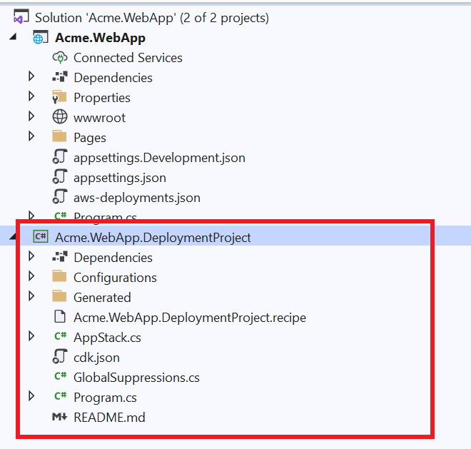

# Adding an Amazon DynamoDB table to your deployment project

In this tutorial, we will create and customize a deployment project to deploy a web application that uses an Amazon DynamoDB table as the backend store to Amazon Elastic Container Service (ECS). We will then add the deployment project to the source control and share with the team for future deployments.

Tasks we will accomplish:

1. Create a new web application called Acme.WebApp.
2. Generate a deployment project using a built-in recipe.
3. Customize the deployment project's recipe file to allow the user to configure a DynamoDB table.
4. Modify the CDK project to add the new DynamoDB setting options.
5. Modify the CDK project to create the DynamoDB table.
6. Pass the DynamoDB table name to the application code using an environment variable our application reads to know which table to use.
7. Add the deployment project to source control.
8. Deploy our Acme.WebApp application using the custom deployment project.

   > **Note:** This tutorial is not concerned with the application logic. You can replace the sample Acme.WebApp used in this tutorial with any other web application.***

### Step 1: Create a new web application

In your command prompt, run the following command to create your app:

```
dotnet new webapp -o Acme.WebApp -f net6.0
```

### Step 2: Generate a deployment project

Navigate to the Acme.WebApp project directory and run the following command to generate a deployment project:

```
dotnet aws deployment-project generate --output ../Acme.WebApp.DeploymentProject --project-display-name "ASP.NET Core app with DynamoDB"
```

The `--project-display-name` switch above configures the name of the recommendation that is shown in the deploy tool when deploying the application project.

The AWS Deploy Tool will analyze the Acme.WebApp project and display which built-in recipes can be used as the starting point of the custom deployment project.

```
Recommended Deployment Option
-----------------------------
1: ASP.NET Core App to AWS Elastic Beanstalk on Linux
This ASP.NET Core application will be built and deployed to AWS Elastic Beanstalk on Linux. Recommended if you do not want to deploy your application as a container image.

Additional Deployment Options
------------------------------
2: ASP.NET Core App to Amazon ECS using Fargate
This ASP.NET Core application will be deployed to Amazon Elastic Container Service (Amazon ECS) with compute power managed by AWS Fargate compute engine. If your project does not contain a Dockerfile, it will be automatically generated. Recommended if you want to deploy your application as a container image on Linux.

3: ASP.NET Core App to AWS App Runner
This ASP.NET Core application will be built as a container image and deployed to AWS App Runner. If your project does not contain a Dockerfile, it will be automatically generated. Recommended if you want to deploy your application as a container image on a fully managed environment.

4: ASP.NET Core App to Existing AWS Elastic Beanstalk Environment
This ASP.NET Core application will be built and deployed to existing AWS Elastic Beanstalk environment. Recommended if you do not want to deploy your application as a container image.

Choose deployment option (recommended default: 1)
```

Pick option #2, "ASP.NET Core App to Amazon ECS using AWS Fargate".

`Acme.WebApp.DeploymentProject` is created in a sibling directory to the application project. If you are using Visual Studio, add the new `Acme.WebApp.DeploymentProject` project to your solution.




### Step 3: Add DynamoDB settings to the recipe file

To give the team members, who will use our deployment project, the choice to either select an existing DynamoDB table or create a new table during deployment, we will add several new settings to our deployment project's recipe definition.

Open the `Acme.WebApp.DeploymentProject.recipe` file located in the deployment project directory in your JSON editor of choice.

Go to the `OptionSettings` section that contains the settings users can use to configure their project.

Create a new "Object" option setting called `Backend` to group all of our new settings using the snippet below. When users configure their deployment, this option will be displayed in the "General" category.

```json
"OptionSettings": [
  ...
  {
    "Id": "Backend",
    "Name": "Backend",
    "Category": "General",
    "Description": "Configure the backend store.",
    "Type": "Object",
    "AdvancedSetting": false,
    "Updatable": true,
    "ChildOptionSettings": [

    ]
  },
...
]
```

Now we will create child option settings to configure DynamoDB settings. The first is a setting to determine if we should create a new table or not. This setting is a `Bool` type which is defaulted to `true`. As a best practice the `Updatable` setting is set to `false` to protect users from accidentally deleting the table when redeploying in the future.

Add the following snippet to the `ChildOptionSettings` of the new `Backend` option we just created:

```json
"ChildOptionSettings": [
    {
      "Id": "CreateNewTable",
      "Name": "Create New DynamoDB Table",
      "Description": "Do you want to create a new DynamoDB table for the backend store?",
      "Type": "Bool",
      "DefaultValue": true,
      "AdvancedSetting": false,
      "Updatable": false
    },
  ...
  ]
```

If the user unchecks the `CreateNewTable` setting, we need to give them the choice to select an existing table. This `ExistingTableName` setting is a "String" type that will store the name of an existing DynamoDB table to use as the backend store.


Add the following snippet to the `ChildOptionSettings` of the new `Backend` option:

```json
"ChildOptionSettings": [
  ...
  {
    "Id": "ExistingTableName",
    "Name": "Existing DynamoDB Table",
    "Description": "Existing DynamoDB table to use as the backend store.",
    "Type": "String",
    "TypeHint": "DynamoDBTableName",
    "DefaultValue": "",
    "AdvancedSetting": false,
    "Updatable": true,
    "DependsOn": [
      {
        "Id": "Backend.CreateNewTable",
        "Value": false
      }
    ],
    "Validators": [
      {
        "ValidatorType": "Regex",
        "Configuration": {
          "Regex": "[a-zA-Z0-9_.-]+",
          "ValidationFailedMessage": "Invalid table name."
        }
      },
      {
        "ValidatorType": "StringLength",
        "Configuration": {
          "MinLength": 3,
          "MaxLength": 255
        }
      }
    ]
  }
]
```

Let us take a deeper dive into the properties for the `ExistingTableName` setting.

* **TypeHint** - Set to `DynamoDBTableName` which tells the deployment tool this String type contains the name of a DynamoDB table. The deploy tool uses this information to show users a list of tables to pick from instead of a text-box.
* **Updatable** - Since modifying the name of an existing table is not a destructive change, we will allow this field to be updated during redeployments.
* **DependsOn** - This setting will only be visible if the previous `CreateNewTable` setting is set to `false`. Notice how the `Id` is the full name of the setting including the parent "Object" setting `Backend`.
* **Validators** - This attaches validators to make sure that the user-provided name matches the regex for valid table names and that the name meets the required minimum and maximum lengths. Adding validators provides feedback to users when invalid values are provided in either the CLI or Visual Studio.

Here is the full snippet of the `Backend` Object option setting with the child settings:

```json
{
  "Id": "Backend",
  "Name": "Backend",
  "Category": "General",
  "Description": "Configure the backend store.",
  "Type": "Object",
  "AdvancedSetting": false,
  "Updatable": true,
  "ChildOptionSettings": [
    {
      "Id": "CreateNewTable",
      "Name": "Create New DynamoDB Table",
      "Description": "Do you want to create a new DynamoDB table for the backend store?",
      "Type": "Bool",
      "DefaultValue": true,
      "AdvancedSetting": false,
      "Updatable": false
    },
    {
      "Id": "ExistingTableName",
      "Name": "Existing DynamoDB Table",
      "Description": "Existing DynamoDB table to use as the backend store.",
      "Type": "String",
      "TypeHint": "DynamoDBTableName",
      "DefaultValue": "",
      "AdvancedSetting": false,
      "Updatable": true,
      "DependsOn": [
        {
          "Id": "Backend.CreateNewTable",
          "Value": false
        }
      ],
      "Validators": [
        {
          "ValidatorType": "Regex",
          "Configuration": {
            "Regex": "[a-zA-Z0-9_.-]+",
            "ValidationFailedMessage": "Invalid table name."
          }
        },
        {
          "ValidatorType": "StringLength",
          "Configuration": {
            "MinLength": 3,
            "MaxLength": 255
          }
        }
      ]
    }
  ]
}
```

### Step 4. Add new setting options to the CDK project

When the CDK project is executed, all settings collected from the user are passed and deserialized into the `Configuration` type. Now we need to customize the CDK project to store the new setting options by modifying the `Configuration` type.

Create a new class called `BackendConfiguration` in the `Configurations` directory. Below is the code for this new type with the properties for `CreateNewTable` and `ExistingTableName`.

   > **Note:** The .NET CDK projects generated by the AWS Deploy Tool have the C# feature `Nullable` enabled in the project file by default. If you do not want this feature enabled, edit the .csproj file and remove the `Nullable` project from the PropertyGroup.***


```csharp
namespace Acme.WebApp.DeploymentProject.Configurations
{
    public class BackendConfiguration
    {
        public bool CreateNewTable { get; set; }

        public string ExistingTableName { get; set; }


        /// A parameterless constructor is needed for <see cref="Microsoft.Extensions.Configuration.ConfigurationBuilder"/>
        /// or the classes will fail to initialize.
        /// The warnings are disabled since a parameterless constructor will allow non-nullable properties to be initialized with null values.
#nullable disable warnings
        public BackendConfiguration()
        {

        }
#nullable restore warnings

        public BackendConfiguration(
            bool createNewTable,
            string existingTableName)
        {
            CreateNewTable = createNewTable;
            ExistingTableName = existingTableName;

        }
    }
}
```

In the `Configuration.cs` file, add a new property for our new backend settings.

```csharp
namespace Acme.WebApp.DeploymentProject.Configurations
{
    public partial class Configuration
    {
        public BackendConfiguration Backend { get; set; } = new BackendConfiguration();
    }
}
```

Notice that the `Backend` property was added to the partial class that is **not** in the `Generated` directory. In both the `Configuration` and `BackendConfiguration` types, the property names match the setting ids used in the recipe file. This is important for the data to be property deserialized.

### Step 5. Add DynamoDB table to the CDK project

   > **Note:** The `AppStack` class is the recommended place to customize the AWS resources.

Modify the constructor of the `AppStack` class to check if `CreateNewTable` is set to `true`. Then  use the `Amazon.CDK.AWS.DynamoDB` CDK construct to create a table as part of the CloudFormation stack.

```csharp
using Amazon.CDK.AWS.DynamoDB;

namespace Acme.WebApp.DeploymentProject
{

    public class AppStack : Stack
    {
        private readonly Configuration _configuration;
        private Table? _ddbBackend;

        internal AppStack(Construct scope, IDeployToolStackProps<Configuration> props)
            : base(scope, props.StackName, props)
        {
            _configuration = props.RecipeProps.Settings;

            // Setup callback for generated construct to provide access to customize CDK properties before creating constructs.
            CDKRecipeCustomizer<Recipe>.CustomizeCDKProps += CustomizeCDKProps;

            if(_configuration.Backend.CreateNewTable == true)
            {
                var backendProps = new TableProps
                {
                    RemovalPolicy = RemovalPolicy.DESTROY,
                    PartitionKey = new Amazon.CDK.AWS.DynamoDB.Attribute { Name = "Id", Type = AttributeType.STRING },
                    BillingMode = BillingMode.PAY_PER_REQUEST,
                };
                _ddbBackend = new Table(this, "Backend", backendProps);
            }

            var generatedRecipe = new Recipe(this, props.RecipeProps);
        }
```

Notice that in the snippet above the table is created before the `Recipe` construct. The `Recipe` construct has all the AWS resources that are part of the original built-in ECS recipe that the deployment project was created from.

### Step 6: Pass the DynamoDB table name to the application code

Now that we have our DynamoDB table, we need to pass the table name into our application code. We will do it by setting an environment variable that the application code will read in the `CustomizeCDKProps` method of the `AppStack` class. `CustomizeCDKProps` is a callback method that gets called for each AWS resource about to be created from the `Recipe` construct.

To know which AWS resource is about to be created, compare the `evnt.ResourceLogicalName` property to the public property name on the `Recipe` construct. The built-in recipes are written to make sure the resource logical name is the same as the public property name. In our scenario we are looking to see if the `AppContainerDefinition` is about to be created.

When we determine that the callback is for `AppContainerDefinition` then we cast the `evnt.Props` to the corresponding property object for `AppContainerDefinition`, in this case `ContainerDefinitionOptions`. From `ContainerDefinitionOptions` we can set the table name in an environment variable.

```csharp
private void CustomizeCDKProps(CustomizePropsEventArgs<Recipe> evnt)
{
    // Example of how to customize the container image definition to include environment variables to the running applications.
    //
    if (string.Equals(evnt.ResourceLogicalName, nameof(evnt.Construct.AppContainerDefinition)))
    {
        if (evnt.Props is ContainerDefinitionOptions props)
        {
            if (props.Environment == null)
                props.Environment = new Dictionary<string, string>();


            if(_ddbBackend != null)
            {
                props.Environment["BACKEND_TABLE"] = _ddbBackend.TableName;
            }
            else
            {
                props.Environment["BACKEND_TABLE"] = _configuration.Backend.ExistingTableName;
            }
        }
    }
}
```

### Step 6: Add deployment project to source control

Check your customized deployment project into your source control repository. This is required to re-deploy your application to existing CloudFormation stacks that were created using custom deployment projects.

### Step 7: Deploy Acme.WebApp application

In your command prompt, run the following command to deploy your application:

```
dotnet aws deploy --project-path .
```

The custom deployment project will be displayed as the recommended option.

```
Recommended Deployment Option
-----------------------------
1: ASP.NET Core app with DynamoDB
This ASP.NET Core application will be deployed to Amazon Elastic Container Service (Amazon ECS) with compute power managed by AWS Fargate compute engine. If your project does not contain a Dockerfile, it will be automatically generated, otherwise an existing Dockerfile will be used. Recommended if you want to deploy your application as a container image on Linux.

Additional Deployment Options
------------------------------
2: ASP.NET Core App to Amazon ECS using AWS Fargate
This ASP.NET Core application will be deployed to Amazon Elastic Container Service (Amazon ECS) with compute power managed by AWS Fargate compute engine. If your project does not contain a Dockerfile, it will be automatically generated, otherwise an existing Dockerfile will be used. Recommended if you want to deploy your application as a container image on Linux.

...

```

Select deployment option #1. You can now see Backend settings option we customized. When you navigate to the `Backend` settings, you will be able to choose between using a new table or picking an existing table.

```
...

Current settings (select number to change its value)
----------------------------------------------------
1. ECS Cluster: AcmeWebApp
2. ECS Service Name: AcmeWebApp-service
3. Backend:
        Create New DynamoDB Table: True
4. Desired Task Count: 3
5. Application IAM Role: *** Create new ***
6. Virtual Private Cloud (VPC): *** Default ***
7. Environment Variables:
8. ECR Repository Name: acmewebapp

...

```

   > **Note:** The AWS Toolkit for Visual Studio will also recognize the custom deployment project. The deployment project will show up as the highest recommended option and the user will also be able to choose between creating a new table or choosing from a drop-down list of available tables in the account that is being deployed to.
